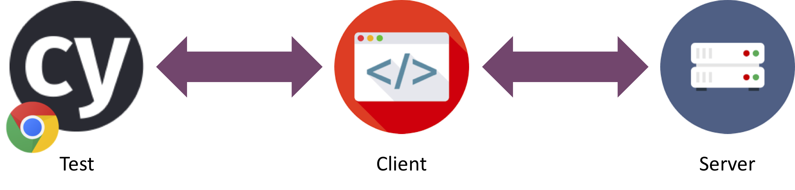

# OVERVIEW AND INSTALLATION

## Welcome!
These pages serve as documentation for the TestCafe Training. You can work through the exercises at your own pace.

The system under test that we will be using is a tabular music tracker. It consists out of a server part, which interfaces with the database. The more visible part is the client, running in your browser as a VueJS project. We will focus on testing the client with Cypress.io.



# Running the project
In order to run the project locally, it is required that you have `npm` and `git` installed. Follow the instructions in the section 'Checking out the project'.

## Checking out the project
1. Clone the [project from GitHub](https://github.com/xebia/testcafe-training)

```
git clone https://github.com/xebia/testcafe-training.git
```

## Starting the client & server

1. Next we will start both the client and the server.

From the root of the project run the following commands:
```
     cd server
     npm install
     npm start
 ```

In another terminal, run the following:
 ```
    cd client
    npm install
    npm start
 ```

 Now go to http://localhost:8080 to check if everything is running correctly.

## Installing Cypress

Installing TestCafe via NPM is easy from your project folder.

By typing `npm install testcafe --save-dev` NPM will do 2 things:

* download TestCafe into the node_modules folder
* add TestCafe (and all packages it depends on) to package.json


## Launching TestCafe

To launch Cypress simply run the following command

```npx cypress open```

This will open the Cypress GUI for you and create the necessary folder structure for you.


 ### About NPM
 NPM stands for Node Package Manager. See [npmjs.com](https://docs.npmjs.com/getting-started/what-is-npm#what-is-npm) for more info.
 In both the folders 'server' and 'client' you find a file called package.json.
 This package.json holds all the information (names, versions) about the npm packages that are used in the project.
 When you start `npm install`, it gathers all the names and versions and tries to install these packages
 from the public NPM repository.

 Package.json also stores some executable commands as shortcuts.
 In this case you may find in the package.json a line which states: "start": "node build/dev-server.js",
 so you can type 'npm start' instead of 'node build/dev-server.js'.
